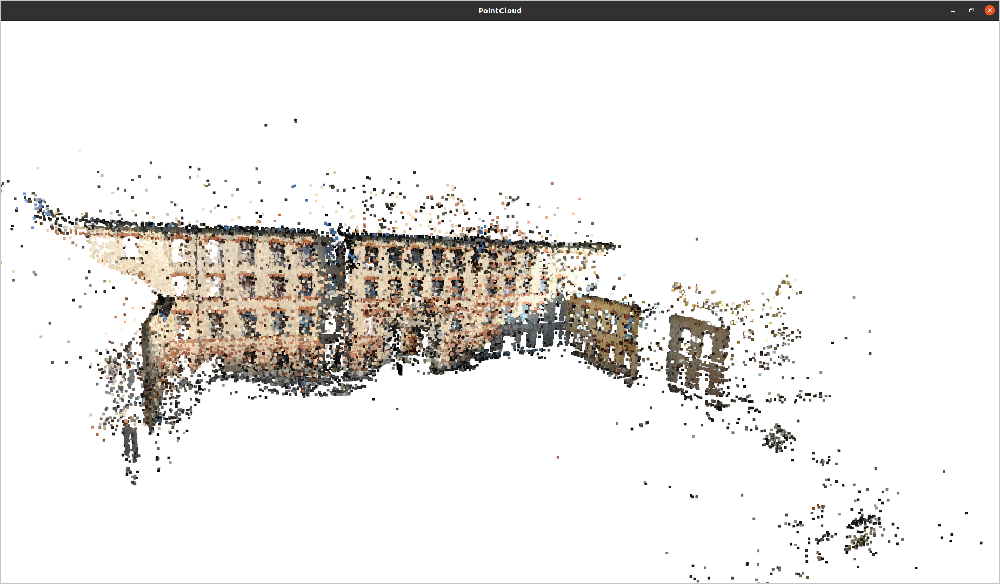
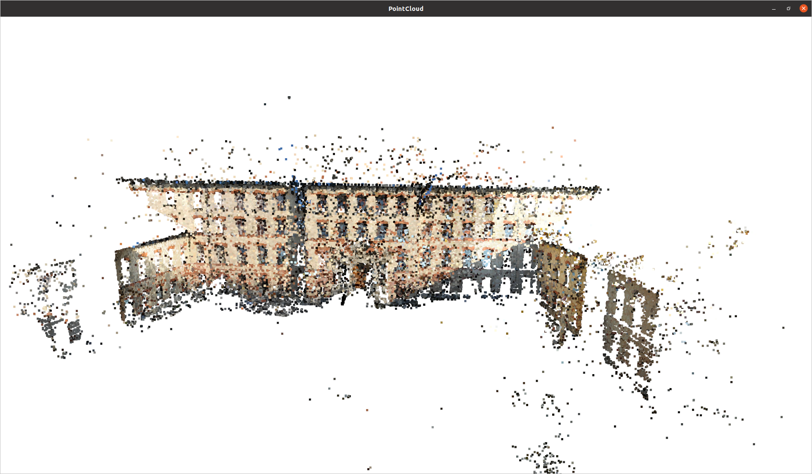

# multiView_SfM
This project implements a custom Structure from Motion (SfM) pipeline in Cpp that constructs 3D scenes from a **sequence** of 2D images.

- Input: A sequence of 2D images, Camera Intrinsics, distortions
- Output: A 3D point cloud corresponding to the input.

## Dependencies:
- OpenCV
- Open3D
- CMake (>=3.10 preferably 4.x)

## Building the Project:

After cloning the project use, 

```
mkdir support/opencv support/open3d
```

The project depends on OpenCV and Open3D libraries and need them to be built dynamically at the location support/opencv and support/open3d. Clone the official opencv and open3d repositories and build them to the respective directories.

Example make options(Recommended):

### OpenCV
```
cd path_to_OpenCV_repo
mkdir build
cd build
cmake -DCMAKE_INSTALL_PREFIX=path_to_opencv_install_location -DBUILD_SHARE_LIBS=ON ..
make -j$(nproc)
make install

```


### Open3D:

```
cd path_to_Open3D_repo
mkdir build
cmake -DCMAKE_INSTALL_PREFIX=path_to_open3d_install_location -DBUILD_SHARED_LIBS=ON ..
make -j$(nproc)
make install
```

It is recommended to use the support/opencv and support/open3d paths created earlier, If you would like to use a different path or have an existing system wide installation then modify the below lines in CMakeLists.txt file accordingly.

```
set(OpenCV_DIR "${CMAKE_CURRENT_LIST_DIR}/support/opencv/lib/cmake/opencv4")
set(Open3D_DIR "${CMAKE_CURRENT_LIST_DIR}/support/open3d/lib/cmake/Open3D")
```

Maintain the following folder structure for executing the tests correctly during the build process. If you don't want to use this setup comment everything from line 44 in CMakeLists.txt. This will skip the testing.
```
tests/
|– data/
|    |– calibration
|    |    |–intrinsics_file_in_COLMAP_format.txt
|    |–images_folder
|    |    |– image_in_png_JPG_JPEG_format

```
Now cd into the Project root directory and build the project.

## Usage:

Once project is built successfully a shared library with name multiview_sfm will be present in the build directory. Following is the usage:

```

./multiview_sfm -i /path_to_intrinsics_file -fp /path_to_2D_images

```

By default the project is set to **Release** in the CMakePresets.json if you want to visualize the matches and the reprojections set it to **Debug** and the images will be saved in the build directory.

The **main.cpp** is just a demonstration of the library, the core idea is to have a reusable implementation of the pipeline. Modify the **SCALE_FACTOR** inside the main.cpp if computePnP fails.

## Sample Output





## Known issues / WIP:

- Distortion coefficients are not considered. Update in progress.
- Feature Extraction takes lot of time and consumes lot of RAM for high res images. Idea is to use OpenMP for optimization, WIP.


## Acknowledgements

Datasets - https://www.eth3d.net/


